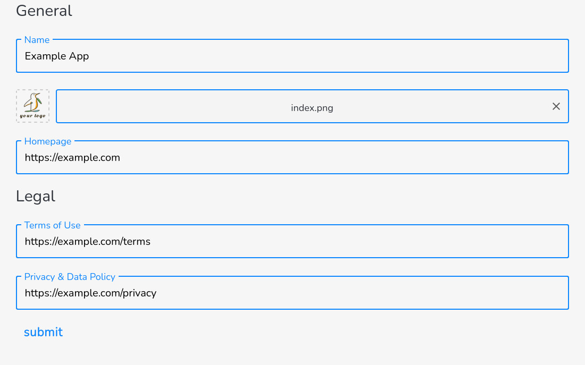
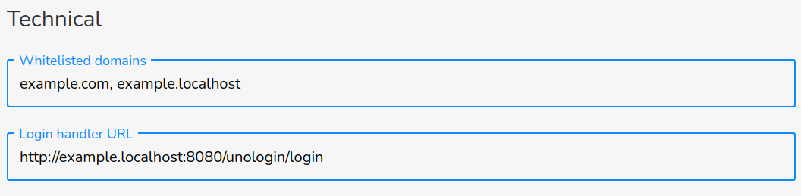
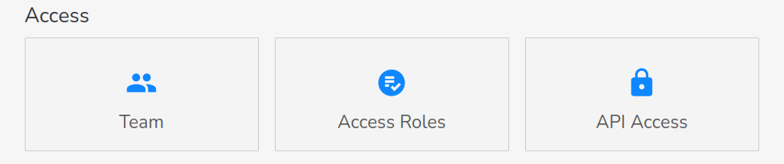
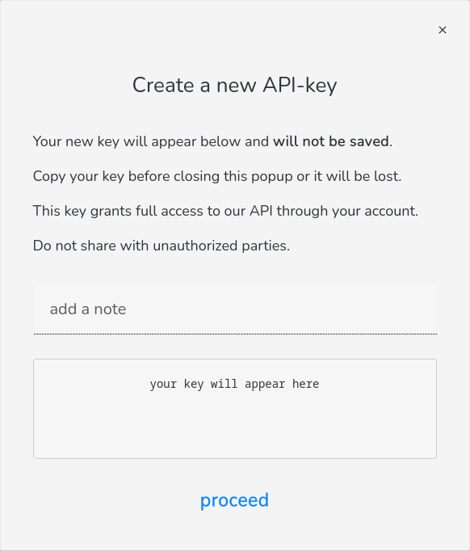
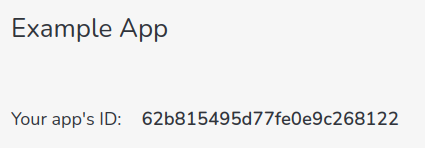

# Getting started guide

This guide will lead you through the process of creating a full stack (Node.js/Express + React) web application using unolog·in for authentication. 

The full project code can be found [here](https://github.com/unologin/express-react-example). 

## Getting access

unolog·in is in a limited access phase right now. In order to get free access, follow the [instructions on the dashboard](https://dashboard.unolog.in/about).

## Register your app

In order to register your app, click on "my apps" in the navigation bar and click on "register an app" or [click here](https://dashboard.unolog.in/apps/register). Fill out the form and click "submit".



## Setting up the login handler

After you register your app, a login handler URL will be derived from your homepage URL. This URL will have to point to your back end.

In order to test locally, you should set this to ```http://[YOUR-APP].localhost:[PORT]/unologin/login```, e.g:

```http
http://example.localhost:8080/unologin/login
```

Also make sure to whitelist the domain ```example.localhost```.




## Getting an API key

In order to register a new API key for your app, click on "my apps" in the navigation bar and select your app. Then click on "API Access" in the "Access" category.



Click on "new API key". 



You can add a note in order to remember what the key is for. 

Click "proceed" and copy the key. 

## Setting up a simple Express server

This section will cover creating a simple express app. If have already set up a node-based server, you can skip this step.

Create a directory for your project, and within, create a new directory for your server. 

```bash
$ mkdir myapp
$ cd my app
$ mkdir server
$ cd server
```

Initialize an ```npm``` or ```yarn``` project. 

```bash
$ npm init
$ # or
$ yarn init
```

Add a start script to your ```package.json``` to start your server:

```json
{
    ...
    "name": "example app",
    "scripts": {
        "start": "node ./main.js"
    },
    ...
}
```

Next, install ```express```, ```cookie-parser``` and ```dotenv```

```bash
$ npm install express cookie-parser dotenv
$ # or
$ yarn add express cookie-parser dotenv
```

Create your ```main.js``` file and add the following code 
```javascript
// load the .env file into process.env
require('dotenv').config();

const express = require('express');

const cookieParser = require('cookie-parser');

// create your app
const app = express();

// add the cookie parser to your app
app.use(cookieParser());

```

## Setting up the environment

In your server directory, create an new file called ```.env``` and enter the following variables:

```properties
# enter your unologin API key
UNOLOGIN_API_KEY=YOUR-API-KEY-FROM-THE-DASHBOARD

# decide where to set/accept login cookies 
UNOLOGIN_COOKIES_DOMAIN=example.localhost
```

The ```UNOLOGIN_COOKIES_DOMAIN``` should cover the domains your backend and frontend run on. If they run on different subdomains like ```example.com``` and ```api.example.com```, you can use the following setup: 

```properties
# note that the domain starts with a dot
UNOLOGIN_COOKIES_DOMAIN=.example.com
```

## Adding unolog·in to your Express app

The full source code for this example can be found [here](https://github.com/unologin/node-api/blob/master/example/main.ts).

Install the unolog·in node-api: 

```bash
$ npm install @unologin/node-api
$ #or 
$ yarn add @unologin/node-api
```

Import the library and call the ```setup(...)``` function. 

```javascript
const unologin = require('@unologin/node-api')

unologin.setup(
  {
    // your unologin api key
    apiKey: process.env.UNOLOGIN_API_KEY,
    // domain(s) on which to set cookies
    cookiesDomain: process.env.UNOLOGIN_COOKIES_DOMAIN,
  },
);
```

In order to test locally, disable secure cookies. Only do this when testing locally. 

The library will refuse to disable secure cookies unless you set your ```NODE_ENV``` to ```development``` in your ```.env``` file but we still recommend adding an additional safeguard.


```javascript
if (process.env.UNOLOGIN_DEBUG_DISABLE_SECURE === 'true')
{ 
  unologin.express.debug_useSecureCookies(false);
}
```
Add these to your ```.env```

```properties
UNOLOGIN_DEBUG_DISABLE_SECURE=true

NODE_ENV=development
```

Now you can start adding the express handlers.

Start by adding a handler for the login event. This should be accessible through the "login handler URL" you set up in the dashboard.

```javascript
app.use('/unologin/login', unologin.express.loginEventHandler);
```

You can now add the ```parseLogin``` handler to routes that may need some user information. 

```javascript
app.use('*', unologin.express.parseLogin);
```

Add ```requireLogin``` to routes that require the user to be logged in.

```javascript
app.use('/me/*', unologin.express.requireLogin);
```

After using ```parseLogin```, the user information will be available in ```res.locals.unologin.user``` if the user is logged in. 

```javascript
app.get('/me/print-user', (req, res) => 
{
  res.send(res.locals.unologin.user);
});
```

Finally, you can use the ```logoutHandler``` to delete all login related cookies. The ```logoutHandler``` will not terminate the request. You will have to add a second handler to do that:

```javascript
app.post('/logout', logoutHandler, function(req, res)
{
  res.send('We hope to have you back soon!');
});
```

Don't forget to start your server after adding all handlers:

```javascript
const port = process.env.PORT || 8080;

app.listen(port, () => 
{
  console.log('Example app listening on port ' + port);
});
```

## Setting up the front end

This example will use ```create-react-app``` to set up the frontend. We don't recommend this to be used for a production application but it is one of the quickest ways to get started. 

```bash
$ npm install -g create-react-app
$ # then in your project root directory
$ npx create-react-app frontend
```

Make yourself some coffee or tea while this runs. When you get back, there will be a directory called "frontend". 

```cd``` into "frontend" and start the development server. 

```bash
$ ls
frontend server
$ cd frontend
$ npm start
```

## Accessing the development server

In order for cookies to work reliably, access the development server through ```http://example.localhost:3000``` (or whichever domain you have whitelisted in the dashboard). 

When making requests to the back end, remember to use ```http://example.localhost:8080```. 

The ports may differ if you haven't followed our example setup. 

## Using ```unologin-scripts```

Install the frontend sdk ```unologin-scripts```:

```bash
$ npm install unologin-scripts
```

Open ```src/App.js``` in your favorite editor and replace it with the following code:

```jsx
import { useEffect, useState } from 'react';
import unologin from 'unologin-scripts';

unologin.setup({ appId: process.env.REACT_APP_UNOLOGIN_APPID });

export default function App() 
{
  const [isLoggedIn, setIsLoggedIn] = useState(unologin.isLoggedIn());

  // only register the callback once
  useEffect(() => 
  {
    unologin.onLogin(() => setIsLoggedIn(true));
  }, [])

  if (!isLoggedIn)
  {
    // examples for different ways of calling startLogin(...)
    return <>
      <button onClick={() => unologin.startLogin({ mode: 'login', userClass: 'users_default'  })}>
        Login
      </button>

      <button onClick={() => unologin.startLogin({ mode: 'register', userClass: 'users_default'  })}>
        Register
      </button>

      <button onClick={() => unologin.startLogin({ userClass: 'users_default'  })}>
        Login or Register
      </button>
    </>;
  }
  else 
  {
    return 'You are now logged in!';
  }
}
```

In your ```frontend``` directory, create a .env file with the following content:

```properties
REACT_APP_UNOLOGIN_APPID=YOUR-APPID
```

Where ```YOUR-APPID``` has to be replaced with your app's ID. You can find this my navigating to "my apps" in the dashboard and clicking on your app. 




## Running the example

To run the example, open two separate terminal sessions and run ```npm start``` from both your ```frontend``` and ```server``` directories. 

Open your browser and navigate to ```http://example.localhost:3000``` and click one of the login buttons. 
